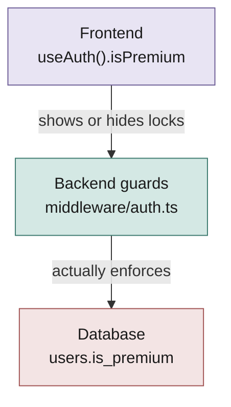
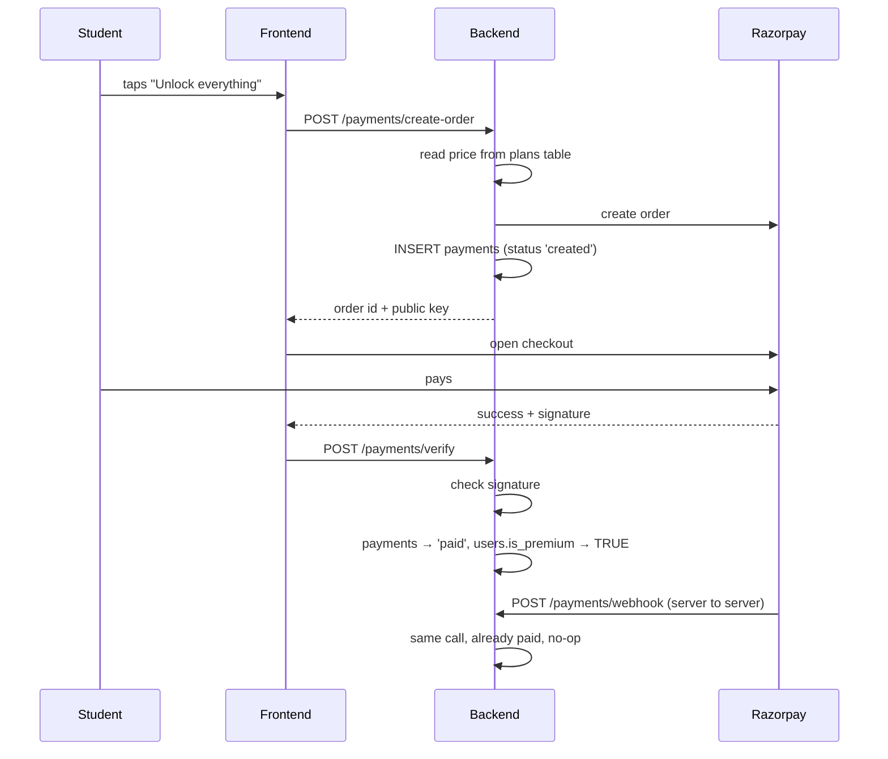

# Paid vs Unpaid — the full flow

How infi-Eureka decides who can see what, end to end: database, backend guards,
payment, and what the frontend does with all of it.

Everything here is traced from the code, with file references so you can jump
straight to it.

---

## The one-line version

**"Paid" is a single boolean column: `users.is_premium`.**

Nothing else. No plans-per-user, no expiry date, no tiers. It starts `FALSE`
(`migrations/versions/0001_users.sql:15`) and one successful payment flips it to
`TRUE` forever.

Two places set it to `TRUE`:

| Where | When |
|---|---|
| `dao/postgres/payment-dao.ts:48` | Razorpay payment confirmed |
| `services/auth-service.ts:147` | test account logs in — **development only** |

---

## The three layers



The important rule: **the frontend's copy of `isPremium` is decoration only.**
It decides what to show. It decides nothing about access. Every protected route
re-reads the database itself, so editing the value in your browser gets you
nowhere.

---

## Layer 1 — the database

```sql
users.is_premium  BOOLEAN NOT NULL DEFAULT FALSE
```

Read by `userDao.isPremium(userId)` (`dao/postgres/user-dao.ts:32`), which runs a
fresh `SELECT` on **every single guarded request**.

This is deliberate, and the comment in `middleware/auth.ts:14` says why: a
student who just paid gets in immediately, without logging out and back in. If
premium lived inside the JWT instead, they would be stuck behind the paywall
until their token expired — up to 7 days.

The cost is one extra query per request. That is the trade being made.

---

## Layer 2 — the backend guards

All six live in `middleware/auth.ts` and attach to routes like
`{ onRequest: [app.requireVideoAccess] }`.

### `requireAuth` — "are you logged in?"

Verifies the JWT. Also rejects a **registration token** — the short-lived token
handed out after OTP but before the account exists. That token has a `purpose`
claim; a session token does not (`middleware/auth.ts:38`). Without this check,
a half-registered phone number could call the whole API.

### `requirePremium` — the strict gate

Logged in **and** `is_premium = TRUE`. No exceptions. Fails with **403 /
`PAYMENT_REQUIRED`**.

### The four "free sample" gates

`requireVideoAccess`, `requireTestAccess`, `requireDocumentAccess`,
`requireAttemptAccess`.

Each is `requirePremium` with one hole punched in it: **premium passes, OR the
item is flagged as the free sample.**

```
premium user?           → allow
this specific item is
the free sample?        → allow
otherwise               → 403 PAYMENT_REQUIRED
```

That is the taste-before-you-pay path. Right now the database has **one free
sample video**, one free test, and one free document.

`requireAttemptAccess` is the subtle one. Routes keyed by *attempt* id can't check
the flag directly, so it resolves the attempt back to its test first
(`middleware/auth.ts:70`). Without it a student could *start* the free test but
never answer or submit it — the attempt routes would lock them out mid-test.

### Which routes use which

| Route | Guard | Unpaid user gets |
|---|---|---|
| `GET /videos`, `/videos/:id` | `requireAuth` | ✅ full catalogue |
| `GET /videos/:id/watch` | `requireVideoAccess` | ❌ unless free sample |
| `GET /tests` | `requireAuth` | ✅ list |
| `GET /tests/:id`, `POST /tests/:id/attempts` | `requireTestAccess` | ❌ unless free sample |
| `GET/PUT/POST /attempts/:id/*` | `requireAttemptAccess` | ❌ unless free sample |
| `GET /notes`, `/library` | `requireAuth` | ✅ list |
| `GET /notes/:id`, `/library/:id` | `requireDocumentAccess` | ❌ unless free sample |
| `GET /health`, `/auth/*`, `/plans/active` | none | ✅ open |

The pattern is consistent and worth stating plainly: **browsing is free,
consuming is not.** An unpaid student sees the entire catalogue — every lecture
title, every test, every chapter — and is stopped only at the moment of opening
one. That is a deliberate sales decision, written into `video-route.ts:24`.

---

## Layer 3 — payment



### Price comes from the database, never the client

`createOrder` (`services/payment-service.ts:68`) reads the amount from the
`plans` table and ignores the request body entirely. The client literally sends
nothing but the request. If price came from the browser, a student could pay ₹1.

Exactly one plan can be active at a time, enforced by a partial unique index
(`0005_payments.sql:17`).

### The signature is the proof

`verify` does not trust the browser saying "payment succeeded". It recomputes
Razorpay's HMAC signature and rejects anything that doesn't match
(`payment-service.ts:110`). A "success" message on its own proves nothing.

It also checks the order belongs to *this* user — and returns the same
"does not exist" error for both a missing order and someone else's, so you can't
probe for valid order ids (`payment-service.ts:105`).

### Two paths in, one door

Both the browser callback (`/payments/verify`) and Razorpay's server-to-server
webhook (`/payments/webhook`) call the same `markPaidAndUpgradeUser`. The webhook
is the safety net for a student whose browser closed before coming back.

Double-crediting is impossible because of three things stacked together:

1. `razorpay_order_id` is `UNIQUE` — there is only ever one row to move
2. `SELECT ... FOR UPDATE` locks that row (`payment-dao.ts:31`)
3. `status` only moves `created → paid` or `created → failed`; an already-`paid`
   row returns `already_paid` and changes nothing

The payment row and the `is_premium` flip happen in **one transaction**
(`payment-dao.ts:30`), so you can never end up with money recorded and no access,
or access with no record.

### The webhook needs raw bytes

Razorpay signs the exact bytes it sent. Parsing the JSON and re-stringifying it
changes those bytes and the signature check then fails for legitimate payments.
That is why `app.ts:53` has a special content-type parser that keeps the raw
buffer for the webhook route only.

---

## Layer 4 — the frontend

### Where premium comes from

`useAuth()` (`hooks/useAuth.tsx:80`) exposes `isPremium`, which comes from the
server via `GET /me` on every page load. It is never stored or guessed.

The JWT lives in `tokenStore` (`api/client.ts`), and `useAuth` clears it on a
401.

### How it reacts

Two mechanisms:

**1. Route guards.** `components/RouteGuards.tsx:21` — a premium-only route
redirects to `/unlock` when `isPremium` is false. This runs before the page even
renders, so an unpaid student never sees a broken screen.

**2. Error handling.** When a request comes back 403 / `PAYMENT_REQUIRED`,
`ApiError.needsPayment` (`api/client.ts:27`) is true, and the page shows a lock
with an "Unlock everything" link instead of an error.

---

## Known issue

**`pages/VideoPlayerPage.tsx:70` checks for status `402`, but the backend sends
`403`.**

`PaymentRequiredError` is defined as 403 (`exceptions/app-error.ts:48`), and
`api/client.ts:27` correctly checks for 403. The video player is the odd one out.

Effect: when an unpaid student taps play on a locked lecture, the `setLocked(true)`
branch never runs. They fall through to the generic error path and see the raw
message as an error line, instead of the proper locked state with an unlock
button. Not a security hole — the backend still refuses — but the wrong screen.

The fix is one line: use `err.needsPayment` like `DocumentReaderPage.tsx:41`
already does.

---

## Production note

The deployed build has **no way for anyone to log in**.

`integrations/` contains only `razorpay` and `storage` — there is no SMS or
WhatsApp provider. In production `requestOtp` generates the code, hashes it into
the database, replies *"We sent a 4-digit code on WhatsApp"*, and sends nothing
anywhere (`services/auth-service.ts:100`).

The test-account shortcut (`9999999999` / `1234`) is gated on `!isProduction`
(`auth-service.ts:101`), so it is off on Cloud Run too.

For a demo, setting `NODE_ENV=development` on the service re-opens the test
account, which is already premium. Before a real launch, a WhatsApp or SMS
provider has to be wired into `requestOtp`.
